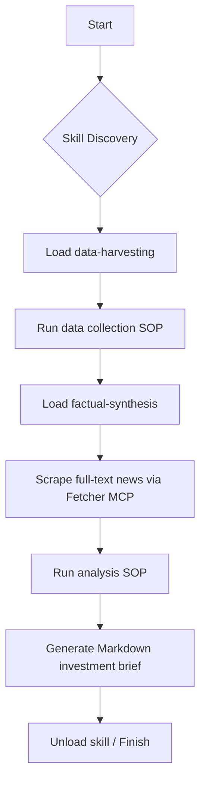

<p align="right">
  <a href="./README.zh-TW.md">🌏 中文說明</a>
</p>

<div align="center">
  
  <h1>⚡ Python Skill POC</h1>
  <p><strong>Just-in-Time (JIT) Skill Loading for AI Agents</strong></p>
  <p>
    
    
    
    
    
  </p>
</div>

| Python | Framework | Manager | LLM | License |
| :---: | :---: | :---: | :---: | :---: |
| 3.12+ | Google ADK | uv | LiteLLM | MIT |

---

## 📖 Table of Contents

- [Background & Motivation](#background)
- [Example: US Stock Research Assistant](#example-us-stock-research-assistant)
- [Project Structure](#project-structure)
- [Skill Directory Mechanics](#skill-directory-mechanics)
- [System Prompt Design](#system-prompt-design)
- [Preparation](#preparation)
- [Installation](#installation)
- [Run the Agent](#run-the-agent)
- [Add New Skills](#add-new-skills)
- [Logging](#logging)
- [Tech Stack](#tech-stack)

---

<a id="background"></a>

## 🚀 Background & Motivation

This proof-of-concept explores **Just-in-Time (JIT) Skill Loading**. Instead of stuffing every standard operating procedure (SOP) and tool into the agent at launch, it dynamically injects the exact SOP + toolset required for each task.

The project is built on [Google ADK](https://google.github.io/adk-docs/) and uses `LiteLLM` so the model backend can be swapped flexibly.

> **⚠️ Pain Points of Traditional Agents**
> 1. **Context Overflow**: Packing irrelevant SOPs into the context window wastes tokens and hurts retrieval accuracy.
> 2. **Behavioral Contamination**: A code-review agent that simultaneously loads a "financial analysis" skill may accidentally apply finance rules while reviewing code.

> **✅ Solution**: JIT skill loading keeps the context clean—**the agent only loads the skill it needs, executes it, then releases it.**

Each skill follows the [agentskills.io](https://agentskills.io/specification) format: every folder contains a `SKILL.md` with YAML frontmatter for metadata plus Markdown SOP content.

---

<a id="example-us-stock-research-assistant"></a>

## 📊 Example: US Stock Research Assistant

The repo ships with a concrete example: **US Stock Intelligence Brief Assistant**.

When a user provides a ticker (e.g., `AAPL`, `NVDA`), the agent executes this workflow:



> [!IMPORTANT]
> The agent never loads both skills at the same time. It strictly follows **"load → execute → move on"**.

---

<a id="project-structure"></a>

## 🏗️ Project Structure

```text
python-skill-poc/
├── main.py                         # Entry point (prints boot info only)
├── pyproject.toml                  # Dependencies managed by uv
└── my_agent/
    ├── agent.py                    # ADK agent definition, MCP tools, callbacks
    ├── skill_manager.py            # Scans skills/, parses SKILL.md metadata
    ├── mcp_config.json             # MCP Server config (e.g., Yahoo Finance)
    ├── mcp_config_dataset.json     # Sample MCP config
    ├── skills/
    │   ├── data-harvesting/
    │   │   └── SKILL.md            # SOP: data collection
    │   └── factual-synthesis/
    │       └── SKILL.md            # SOP: intel synthesis
    └── tools/
        ├── skills.py               # Skill management utilities
        └── time.py                 # Time helper
```

### Core Components

| Component | Responsibility |
| :--- | :--- |
| <strong><code>SkillManager</code></strong> | Scans `skills/` at startup and reads metadata only (lazy loading). |
| <strong><code>discover_skills()</code></strong> | Tool that returns a summary of all available skills. |
| <strong><code>load_skill_protocol()</code></strong> | Tool that fetches the full SOP content of a specific skill. |
| <strong><code>log_prompt_length</code></strong> | Callback that records prompt length and stores each LLM call under `logs/`. |
| <strong>MCP Toolset</strong> | Connects to external MCP servers via `mcp_config.json`. |

---

<a id="skill-directory-mechanics"></a>

## ⚙️ Skill Directory Mechanics

Each skill lives under `my_agent/skills/` as a folder containing `SKILL.md`:

```markdown
---
name: data-harvesting
description: Collect current & historical stock prices plus the latest company news.
metadata:
  version: "1.0"
---

Steps:
1. Use get_current_time to fetch the current system time.
2. Fetch historical pricing...
```

- **Frontmatter**: parsed at startup for lightweight skill discovery.
- **Body**: loaded on demand only when the agent explicitly requests that skill.

---

<a id="system-prompt-design"></a>

## 🛡️ System Prompt Design

The agent operates under a four-layer governance stack:

> [!NOTE]
> **Governance → Role → Task → Tool**

1. **Governance Layer**: Enforces zero hallucinations, source attribution, and JIT skill loading.
2. **Role Layer**: Equity research associate at an investment bank.
3. **Task Layer**: Defines the five strict steps of the US stock brief workflow.
4. **Tool Layer**: Skill tools, MCP tools, and local Python helpers.

---

<a id="preparation"></a>

## 🛠️ Preparation

- **Python**: 3.12+
- **Manager**: [`uv`](https://docs.astral.sh/uv/) package manager
- **LLM**: Azure OpenAI (or compatible) API key

---

<a id="installation"></a>

## 📦 Installation

<details open>
  <summary><strong>1. Clone the repo</strong></summary>

```bash
git clone https://github.com/long0426/python-skill-poc.git
cd python-skill-poc
```
</details>

<details open>
  <summary><strong>2. Install dependencies via <code>uv</code></strong></summary>

```bash
uv sync
```
</details>

<details open>
  <summary><strong>3. Set environment variables</strong></summary>
Create `.env` under `my_agent/`:

```env
AZURE_API_KEY=your-key
AZURE_API_BASE=https://your-resource-name.openai.azure.com/
AZURE_API_VERSION=2024-02-01
```
</details>

<details open>
  <summary><strong>4. Configure MCP servers (optional)</strong></summary>
The agent can attach multiple MCP servers. Two common sources are listed below along with the corresponding `my_agent/mcp_config.json` settings.

| Server | Purpose | Highlight |
| :--- | :--- | :--- |
| **Yahoo Finance MCP** | Pull real-time/historical quotes & news | Python-based, integrates nicely with UV envs |
| **Fetcher MCP** | Unified Web/API/RSS fetching | Launch via `npx`, highly extensible |

<details open>
  <summary><strong>Yahoo Finance MCP</strong></summary>

**Step 1: Clone and create the virtual environment**

```bash
git clone https://github.com/Alex2Yang97/yahoo-finance-mcp.git
cd yahoo-finance-mcp
uv venv
source .venv/bin/activate  # Windows: .venv\Scripts\activate
uv pip install -e .
```

**Step 2: Register the server in `my_agent/mcp_config.json`**

```json
"yfinance": {
  "command": "uv",
  "args": [
    "--directory",
    "/absolute/path/to/yahoo-finance-mcp",
    "run",
    "server.py"
  ]
}
```
</details>

<details open>
  <summary><strong>Fetcher MCP (multi-source data)</strong></summary>

**Step 1:** Follow the [fetcher-mcp](https://github.com/jae-jae/fetcher-mcp) docs to set up API tokens and pipelines.

**Step 2:** Add this entry to `my_agent/mcp_config.json` (use `env` if extra variables are needed):

```json
"fetcher": {
  "command": "npx",
  "args": ["-y", "fetcher-mcp"]
}
```
</details>

<details open>
  <summary><strong>Example: Multiple MCP servers</strong></summary>
After completing the steps above, your config can look like this:

```json
{
  "mcpServers": {
    "yfinance": {
      "command": "uv",
      "args": [
        "--directory",
        "/Users/long0426/Documents/project/mcp/yahoo-finance-mcp",
        "run",
        "server.py"
      ]
    },
    "fetcher": {
      "command": "npx",
      "args": ["-y", "fetcher-mcp"]
    }
  }
}
```

Restart the agent and you can tap into both data pipelines, selecting the right MCP tool per step.
</details>
</details>

---

<a id="run-the-agent"></a>

## 👋 Run the Agent

Launch via the ADK web UI:

```bash
uv run adk web .
```

Open `http://localhost:8000/dev-ui/?app=my_agent` and start chatting with ticker symbols:

```
AAPL
NVDA
TSLA
```

---

<a id="add-new-skills"></a>

## ➕ Add New Skills

<ol>
  <li>Create a folder under <code>my_agent/skills/</code>, e.g., <code>my_agent/skills/risk-assessment/</code>.</li>
  <li>
    Add <code>SKILL.md</code> with YAML frontmatter:

```markdown
---
name: risk-assessment
description: Evaluate downside risks and volatility for a specific ticker.
---

Place your SOP here...
```
  </li>
  <li>Restart the agent — <code>SkillManager</code> will auto-discover the new skill at boot.</li>
</ol>

---

<a id="logging"></a>

## 📂 Logging

Every LLM call is stored under `my_agent/logs/`. Each session gets a timestamped folder, which is useful for debugging prompts, verifying the injection flow, and auditing token usage.

```
my_agent/logs/
└── AAPL_20260313101500/
    ├── call_001.txt    # First call: system prompt + context
    ├── call_002.txt    # Second call contents
    └── ...
```

---

<a id="tech-stack"></a>

## 💎 Tech Stack

| Package | Purpose |
| :--- | :--- |
| `google-adk[gradio]` | Agent framework and web UI |
| `litellm` | Unified LLM API (Azure, OpenAI, Anthropic, etc.) |
| `python-frontmatter` | Parse YAML metadata from `SKILL.md` |
| `pyyaml` | YAML support |
| `gradio` | Web front end |
| `uv` | Fast project dependency management |

---
