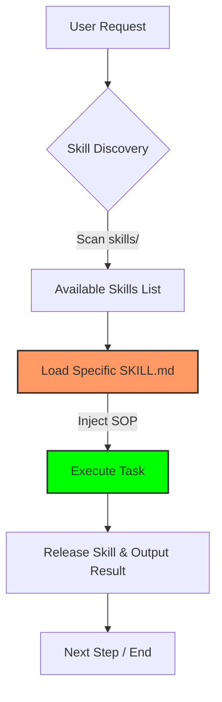

<p align="right">
  <a href="./README.zh-TW.md">繁體中文版</a>
</p>

<p align="center">
  
</p>

<h1 align="center">Python Skill POC</h1>

<p align="center">
  <strong>Just-in-Time (JIT) Skill Loading for AI Agents</strong>
</p>

<p align="center">
  
  
  
  
</p>

---

## 💡 Core Concept: Just-in-Time (JIT) Loading

This is a technical Proof of Concept (POC) project for **Just-in-Time (JIT) Skill Loading**. The core idea is to **dynamically** inject domain-specific Standard Operating Procedures (SOPs) and tools into an AI Agent based on task requirements, rather than overloading the agent with all capabilities at startup.

> [!TIP]
> **Advantages:** 
> 1. **Token Efficiency**: Prevents irrelevant SOPs from consuming the Context Window.
> 2. **Behavioral Integrity**: Avoids "behavioral contamination" between skills, ensuring the agent remains focused on the current task.

---

## 🛠️ Technical Architecture

This project demonstrates a streamlined **"Load → Execute → Release"** cycle:



### Directory Structure

```text
my_agent/
├── agent.py            # 🤖 ADK Agent definition & Governance rules
├── skill_manager.py     # 📂 Skill scanning & Metadata parsing
├── mcp_config.json      # 🔌 MCP Server configuration center
├── skills/              # 📚 Skill Library (each contains SKILL.md)
│   ├── data-harvesting
│   └── factual-synthesis
└── tools/               # 🔧 Local Python tools
```

---

## 🚀 Scenario: US Stock Research Assistant

When a stock symbol (e.g., `NVDA`) is provided, the agent executes a precise workflow:

| Step | Action | Skill / Tool |
|---|---|---|
| 1 | **Skill Discovery** | `discover_skills()` |
| 2 | **Data Harvesting** | Load `data-harvesting` |
| 3 | **Factual Synthesis** | Load `factual-synthesis` |
| 4 | **Report Output** | Generate structured Markdown |

---

## 💻 Quick Start

### 1. Environment Setup
- Python 3.12+
- [uv](https://docs.astral.sh/uv/) (Highly Recommended)

```bash
git clone https://github.com/long0426/python-skill-poc.git
cd python-skill-poc
uv sync
```

```bash
# 1. Clone the repository
git clone https://github.com/Alex2Yang97/yahoo-finance-mcp.git
cd yahoo-finance-mcp

# 2. Create and activate virtual environment, install dependencies
uv venv
source .venv/bin/activate  # Windows: .venv\Scripts\activate
uv pip install -e .
```

### 4.2 Install Fetcher MCP and Browser

`Fetcher MCP` runs via `npx`, but you must install the Playwright browser core before the first use:

```bash
# Install Playwright browser (only needs to be run once)
npx playwright install chromium
```

> [!NOTE]
> **Why install Playwright?**
> Unlike traditional scrapers, Playwright launches a real browser core to execute JavaScript, allowing the Agent to read modern dynamic web content.

### 4.3 Configure my_agent

Edit `my_agent/mcp_config.json` to point to your MCP server. Ensure that `/absolute/path/to/` is replaced with your actual absolute path:

```json
{
    "mcpServers": {
        "yfinance": {
            "command": "uv",
            "args": ["--directory", "/absolute/path/to/yahoo-finance-mcp", "run", "server.py"]
        },
        "fetcher": {
            "command": "npx",
            "args": ["-y", "fetcher-mcp"]
        }
    }
}
```

---

## 🏃 Run Agent

Launch the Agent using the ADK web UI:

```bash
uv run adk web .
```

Then open your browser and go to `http://localhost:8000/dev-ui/?app=my_agent`. Enter a stock symbol to start the conversation:

```bash
# Example inputs
AAPL
NVDA
TSLA
```

---

## 📝 How to Add Skills

1. Create a new directory under `my_agent/skills/`, e.g., `my_agent/skills/risk-assessment/`.
2. Add a `SKILL.md` file with YAML Frontmatter:

```markdown
---
name: risk-assessment
description: Evaluate downside risk factors and volatility for a specific stock.
---

Enter your SOP content here...
```

3. Restart the agent — `SkillManager` will automatically discover the new skill at startup.

---

## 📊 Logging

Every LLM call is automatically logged in `my_agent/logs/`. Each session generates a timestamped subdirectory:

```text
my_agent/logs/
└── AAPL_20260313101500/
    ├── call_001.txt    # System Prompt + Context (1st call)
    ├── call_002.txt    # Content of the 2nd call
    └── ...
```

This is valuable for debugging prompt content, verifying skill injection logic, and auditing token consumption.

---

## ⚙️ Technology Stack

| Package | Purpose |
|---|---|
| `google-adk[gradio]` | Agent framework and web UI |
| `litellm` | Unified LLM API (supports Azure, OpenAI, Anthropic, etc.) |
| `python-frontmatter` | Parse YAML metadata from `SKILL.md` |
| `pyyaml` | YAML support |
| `gradio` | Web interaction interface |

---

## 🛡️ License

MIT. Crafted with care by **G-Agent** for **Long-Ge**.
