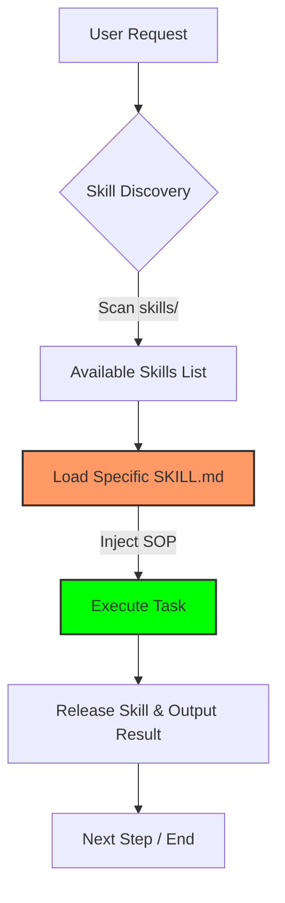

<p align="right">
  <a href="./README.md">English Version</a>
</p>

<p align="center">
  
</p>

<h1 align="center">Python Skill POC</h1>

<p align="center">
  <strong>Just-in-Time (JIT) Skill Loading for AI Agents</strong>
</p>

<p align="center">
  
  
  
  
</p>

---

## 💡 核心概念：按需加載 (JIT Loading)

這是一個關於 **Just-in-Time (JIT) Skill Loading** 的技術驗證專案。核心概念是：根據任務需求，**動態地**將特定領域的標準作業程序 (SOP) 與工具注入到 AI Agent 中，而不是在啟動時就塞入所有內容。

> [!TIP]
> **優勢：** 
> 1. **節省 Token**：避免無關的 SOP 佔用 Context Window。
> 2. **精準行為**：防止技能間的行為污染，確保 Agent 專注於當前任務。

---

## 🛠️ 技術架構

本專案展示了 **「載入 → 執行 → 釋放」** 的極簡循環：



### 目錄結構

```text
my_agent/
├── agent.py            # 🤖 ADK Agent 定義與治理規則
├── skill_manager.py     # 📂 技能掃描與元數據解析
├── mcp_config.json      # 🔌 MCP Server 配置中心
├── skills/              # 📚 技能庫 (各包含 SKILL.md)
│   ├── data-harvesting
│   └── factual-synthesis
└── tools/               # 🔧 本地 Python 工具組
```

---

## 🚀 範例展示：美股研究助理

當輸入股票代號（如 `NVDA`）時，Agent 會執行精密的工作流：

| 步驟 | 動作 | 技能 / 工具 |
|---|---|---|
| 1 | **技能發現** | `discover_skills()` |
| 2 | **資料採集** | 加載 `data-harvesting` |
| 3 | **深度分析** | 加載 `factual-synthesis` |
| 4 | **產出報告** | 生成結構化 Markdown |

---

## 💻 快速開始

### 1. 準備環境
- Python 3.12+
- [uv](https://docs.astral.sh/uv/) (強烈推薦)

```bash
git clone https://github.com/long0426/python-skill-poc.git
cd python-skill-poc
uv sync
```

```bash
# 1. 複製儲存庫
git clone https://github.com/Alex2Yang97/yahoo-finance-mcp.git
cd yahoo-finance-mcp

# 2. 建立並啟動虛擬環境，安裝依賴
uv venv
source .venv/bin/activate  # Windows 使用: .venv\Scripts\activate
uv pip install -e .
```

**4.2 安裝 Fetcher MCP 與瀏覽器**

`Fetcher MCP` 透過 `npx` 執行，但第一次使用前必須安裝 Playwright 所需的瀏覽器核心：

```bash
# 安裝 Playwright 瀏覽器 (僅需執行一次)
npx playwright install chromium
```

> [!NOTE]
> **為什麼要安裝 Playwright？**
> 與傳統爬蟲不同，Playwright 會啟動真實瀏覽器核心執行 JavaScript，這讓 Agent 能讀取現代化的動態網頁內容。

**4.3 配置 my_agent**

編輯 `my_agent/mcp_config.json` 以指向你的 MCP server。請確保將 `/絕對路徑/到/` 替換為實際的絕對路徑：

```json
{
    "mcpServers": {
        "yfinance": {
            "command": "uv",
            "args": ["--directory", "/絕對路徑/到/yahoo-finance-mcp", "run", "server.py"]
        },
        "fetcher": {
            "command": "npx",
            "args": ["-y", "fetcher-mcp"]
        }
    }
}
```


---

## 執行 Agent

使用 ADK web UI 啟動 Agent：

```bash
uv run adk web .
```

接著開啟瀏覽器並前往 `http://localhost:8000/dev-ui/?app=my_agent`，輸入股票代號開始對話：

```
AAPL
NVDA
TSLA
```

---

## 如何新增技能

1. 在 `my_agent/skills/` 下建立新目錄，例如 `my_agent/skills/risk-assessment/`。
2. 新增 `SKILL.md` 檔案，並填入 YAML Frontmatter：

```markdown
---
name: risk-assessment
description: 評估特定股票的下行風險因素與波動率。
---

這裡填入你的 SOP 內容...
```

3. 重啟 Agent —— `SkillManager` 會在啟動時自動發現新技能，無需修改任何程式碼。

---

## 紀錄 (Logging)

每次 LLM 呼叫都會自動記錄在 `my_agent/logs/` 中。每個 Session 會建立一個帶時間戳的子目錄：

```
my_agent/logs/
└── AAPL_20260313101500/
    ├── call_001.txt    # 第一次呼叫的 System Prompt + Context
    ├── call_002.txt    # 第二次呼叫的內容
    └── ...
```

這對於除錯 Prompt 內容、驗證技能注入邏輯以及審計 Token 消耗非常有用。

---

## 技術堆疊

| 套件 | 用途 |
|---|---|
| `google-adk[gradio]` | Agent 框架與網頁 UI |
| `litellm` | 統一的 LLM API (支援 Azure, OpenAI, Anthropic 等) |
| `python-frontmatter` | 解析 SKILL.md 的 YAML 元數據 |
| `pyyaml` | YAML 支援 |
| `gradio` | 網頁前端介面 |

---
