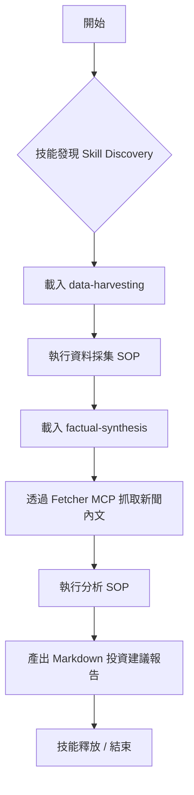

<p align="right">
  <a href="./README.md">🌐 English Version</a>
</p>

<div align="center">
  
  <h1>⚡ Python Skill POC</h1>
  <p><strong>Just-in-Time (JIT) Skill Loading for AI Agents</strong></p>
  <p>
    
    
    
    
    
  </p>
</div>

| Python | Framework | Manager | LLM | License |
| :---: | :---: | :---: | :---: | :---: |
| 3.12+ | Google ADK | uv | LiteLLM | MIT |

---

## 📖 目錄

- [背景與動機](#背景與動機)
- [範例展示：美股研究助理](#範例展示美股研究助理)
- [專案架構](#專案架構)
- [技能 (Skills) 目錄運作機制](#技能-skills-目錄運作機制)
- [System Prompt 設計](#system-prompt-設計)
- [準備工作](#準備工作)
- [安裝步驟](#安裝步驟)
- [執行 Agent](#執行-agent)
- [如何新增技能](#如何新增技能)
- [紀錄 (Logging)](#紀錄-logging)
- [技術堆疊](#技術堆疊)

---

<a id="背景與動機"></a>

## 🚀 背景與動機

這是一個關於 **Just-in-Time (JIT) Skill Loading (按需加載技能)** 的技術驗證 (POC) 專案。核心概念是：根據任務需求，動態將特定領域的標準作業程序 (SOP) 與工具注入到 AI Agent 中，而非在啟動時就塞入所有內容。

本專案基於 [Google ADK](https://google.github.io/adk-docs/) 開發，並使用 `LiteLLM` 來確保模型切換的靈活性。

> **⚠️ 傳統 AI Agent 的痛點**
> 1. **上下文爆量 (Context Overflow)**：將無關的 SOP 塞進 Context Window 會浪費 Token，並降低模型的檢索準確度（容易失憶）。
> 2. **行為污染 (Behavioral Contamination)**：例如一個負責「程式碼審查」的 Agent，如果同時啟動了「財務分析」技能，可能會在審查程式時意外套用了財務規則。

> **✅ 解決方案**：本專案展示了一個更乾淨的模式 —— **Agent 只在需要時，才加載對應的技能，執行完後即釋放。**

Skill 格式參考了 <a href="https://agentskills.io/specification">agentskills.io</a> 的規範 —— 每個 Skill 都是一個 <code>SKILL.md</code> 檔案，包含 YAML Frontmatter 格式的標記資料 (Metadata) 以及 Markdown 格式的 SOP 內容。

---

<a id="範例展示美股研究助理"></a>

## 📊 範例展示：美股研究助理

專案內包含了一個具體的實作範例：<strong>美股情報簡報助理 (US Stock Intelligence Brief Assistant)</strong>。

當使用者提供股票代號（例如：<code>AAPL</code>, <code>NVDA</code>）時，Agent 會嚴格執行以下工作流：



> [!IMPORTANT]
> Agent 永遠不會同時加載這兩個技能，而是遵循嚴格的 <strong>「載入 → 執行 → 繼續下一步」</strong> 的循環。

---

<a id="專案架構"></a>

## 🏗️ 專案架構

```text
python-skill-poc/
├── main.py                         # 程式進入點 (僅印出啟動資訊)
├── pyproject.toml                  # 使用 uv 管理的依賴套件
└── my_agent/
    ├── agent.py                    # ADK Agent 定義、MCP 工具組、回調函式
    ├── skill_manager.py            # 掃描 skills/ 目錄，解析 SKILL.md 的標記資料
    ├── mcp_config.json             # MCP Server 設定 (例如：Yahoo Finance)
    ├── mcp_config_dataset.json     # 備用的 MCP 設定範例
    ├── skills/
    │   ├── data-harvesting/
    │   │   └── SKILL.md            # SOP：資料採集
    │   └── factual-synthesis/
    │       └── SKILL.md            # SOP：情報分析
    └── tools/
        ├── skills.py               # Skill 管理工具
        └── time.py                 # 時間工具
```

### 核心元件說明

| 元件 | 職責 |
| :--- | :--- |
| <strong><code>SkillManager</code></strong> | 在啟動時掃描 <code>skills/</code> 目錄，僅讀取元數據（延遲加載）。 |
| <strong><code>discover_skills()</code></strong> | 工具 —— 回傳所有可用 Skill 的摘要。 |
| <strong><code>load_skill_protocol()</code></strong> | 工具 —— 讀取並回傳特定 Skill 的完整 SOP 內容。 |
| <strong><code>log_prompt_length</code></strong> | 回調函式 —— 紀錄 Prompt 長度，並將 LLM 呼叫存檔至 <code>logs/</code>。 |
| <strong>MCP Toolset</strong> | 依據 <code>mcp_config.json</code> 連接外部 MCP Server。 |

---

<a id="技能-skills-目錄運作機制"></a>

## ⚙️ 技能 (Skills) 目錄運作機制

每個 Skill 都是 <code>my_agent/skills/</code> 下的一個子目錄，其中包含一個 <code>SKILL.md</code> 檔案：

```markdown
---
name: data-harvesting
description: 收集當前與歷史股價，以及最新的公司新聞。
metadata:
  version: "1.0"
---

步驟：
1. 使用 get_current_time 工具獲取當前系統時間。
2. 獲取歷史股價...
```

- <strong>Frontmatter</strong>：啟動時解析，用於輕量級的 Skill 發現 (Discovery)。
- <strong>Body</strong>：按需加載，只有當 Agent 明確請求讀取該 Skill 內容時才會載入。

---

<a id="system-prompt-設計"></a>

## 🛡️ System Prompt 設計

Agent 運行於一個四層治理架構下：

> [!NOTE]
> <strong>治理層 (Governance)</strong> → <strong>角色層 (Role)</strong> → <strong>任務層 (Task)</strong> → <strong>工具層 (Tool)</strong>

1. **治理層**：強制執行「零幻覺」、「來源標註」以及「JIT Skill 加載」規則。
2. **角色層**：投資銀行的股票研究助理。
3. **任務層**：定義了美股情報簡報的 5 個嚴格執行步驟。
4. **工具層**：包含 Skill 管理工具、MCP 工具以及本地 Python 函式。

---

<a id="準備工作"></a>

## 🛠️ 準備工作

- **Python**：3.12+
- **Manager**：[`uv`](https://docs.astral.sh/uv/) 套件管理工具
- **LLM**：Azure OpenAI（或相容）API 金鑰

---

<a id="安裝步驟"></a>

## 📦 安裝步驟

<details open>
  <summary><strong>1. 複製儲存庫</strong></summary>

```bash
git clone https://github.com/long0426/python-skill-poc.git
cd python-skill-poc
```
</details>

<details open>
  <summary><strong>2. 使用 <code>uv</code> 安裝依賴</strong></summary>

```bash
uv sync
```
</details>

<details open>
  <summary><strong>3. 設定環境變數</strong></summary>
在 <code>my_agent/</code> 下建立 <code>.env</code>：

```env
AZURE_API_KEY=你的金鑰
AZURE_API_BASE=https://你的資源名稱.openai.azure.com/
AZURE_API_VERSION=2024-02-01
```
</details>

<details open>
  <summary><strong>4. 設定 MCP Server (選配)</strong></summary>
Agent 可以同時掛載多個 MCP Server。以下列出兩個常用來源，並示範如何在 <code>my_agent/mcp_config.json</code> 中完成設定。

  | Server | 用途 | 亮點 |
  | :--- | :--- | :--- |
  | **Yahoo Finance MCP** | 取得即時/歷史股價與公司新聞 | Python 工具鏈、輕鬆串接 UV 虛擬環境 |
  | **Fetcher MCP** | 透過多種抓取器統一取得 Web/API/RSS 資料 | 以 `npx` 快速啟動，擴充性強 |

  <details open>
    <summary><strong>Yahoo Finance MCP 安裝與註冊</strong></summary>

**步驟 1：複製專案並建立虛擬環境**

```bash
git clone https://github.com/Alex2Yang97/yahoo-finance-mcp.git
cd yahoo-finance-mcp
uv venv
source .venv/bin/activate  # Windows 使用: .venv\Scripts\activate
uv pip install -e .
```

**步驟 2：在 `my_agent/mcp_config.json` 中加入伺服器節點，指向本地專案路徑**

```json
"yfinance": {
  "command": "uv",
  "args": [
    "--directory",
    "/絕對路徑/到/yahoo-finance-mcp",
    "run",
    "server.py"
  ]
}
```
  </details>

  <details open>
    <summary><strong>Fetcher MCP（多來源資料拉取）</strong></summary>

**步驟 1：** 依 <a href="https://github.com/jae-jae/fetcher-mcp">fetcher-mcp</a> 說明建立所需的環境變數（API Token、管線設定等）。

**步驟 2：** 在 `my_agent/mcp_config.json` 加入以下節點（若需額外環境變數，可使用 `env` 欄位）：

```json
"fetcher": {
  "command": "npx",
  "args": ["-y", "fetcher-mcp"]
}
```
  </details>

  <details open>
    <summary><strong>範例整合：同時掛載多個 MCP</strong></summary>
完成上述設定後，你的 <code>my_agent/mcp_config.json</code> 可長這樣：

```json
{
  "mcpServers": {
    "yfinance": {
      "command": "uv",
      "args": [
        "--directory",
        "/Users/long0426/Documents/project/mcp/yahoo-finance-mcp",
        "run",
        "server.py"
      ]
    },
    "fetcher": {
      "command": "npx",
      "args": ["-y", "fetcher-mcp"]
    }
  }
}
```

重新啟動 Agent 後即可同時使用兩種資料管道，按照任務需求動態挑選最合適的 MCP Tool。
  </details>
</details>

---

<a id="執行-agent"></a>

## 👋 執行 Agent

使用 ADK web UI 啟動：

```bash
uv run adk web .
```

接著開啟瀏覽器並前往 <code>http://localhost:8000/dev-ui/?app=my_agent</code>，輸入股票代號開始對話：

```
AAPL
NVDA
TSLA
```

---

<a id="如何新增技能"></a>

## ➕ 如何新增技能

<ol>
  <li>在 <code>my_agent/skills/</code> 下建立新目錄，例如 <code>my_agent/skills/risk-assessment/</code>。</li>
  <li>
    新增 <code>SKILL.md</code> 檔案，並填入 YAML Frontmatter：

```markdown
---
name: risk-assessment
description: 評估特定股票的下行風險因素與波動率。
---

這裡填入你的 SOP 內容...
```
  </li>
  <li>重啟 Agent —— <code>SkillManager</code> 會在啟動時自動發現新技能，無需修改任何程式碼。</li>
</ol>

---

<a id="紀錄-logging"></a>

## 📂 紀錄 (Logging)

每次 LLM 呼叫都會自動記錄在 <code>my_agent/logs/</code> 中。每個 Session 會建立一個帶時間戳的子目錄，這對於除錯 Prompt 內容、驗證技能注入邏輯以及審計 Token 消耗非常有用。

```
my_agent/logs/
└── AAPL_20260313101500/
    ├── call_001.txt    # 第一次呼叫的 System Prompt + Context
    ├── call_002.txt    # 第二次呼叫的內容
    └── ...
```

---

<a id="技術堆疊"></a>

## 💎 技術堆疊

| 套件 | 用途 |
| :--- | :--- |
| <code>google-adk[gradio]</code> | Agent 框架與網頁 UI |
| <code>litellm</code> | 統一的 LLM API (支援 Azure, OpenAI, Anthropic 等) |
| <code>python-frontmatter</code> | 解析 <code>SKILL.md</code> 的 YAML 元數據 |
| <code>pyyaml</code> | YAML 支援 |
| <code>gradio</code> | 網頁前端介面 |
| <code>uv</code> | 高效的專案依賴管理 |

---
